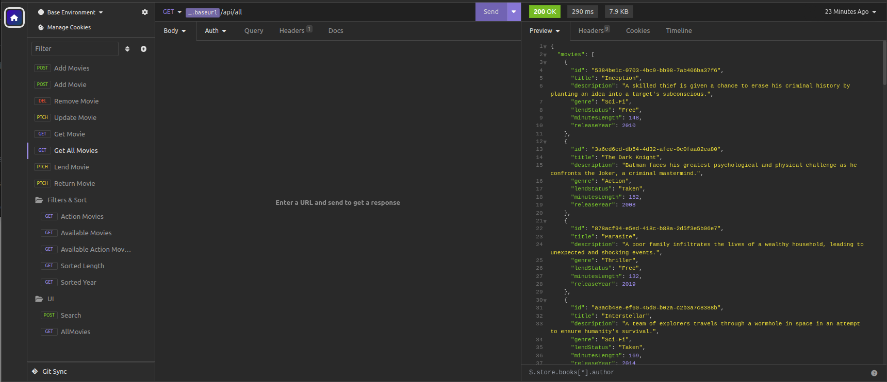
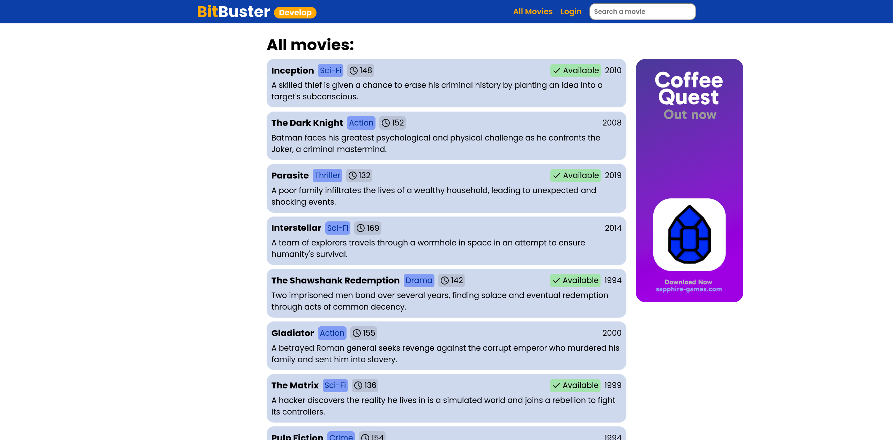

# Videothek Example Project
This is an example project with the sole purpose of learning Kotlin with Springboot.
It can be used as an example to see how to implement and integrate something. 

## Technologies
This project utilizes the `Springboot` Framework in a combination with `Kotlin` and `Gradle`.

Furthermore it contains a simple UI built with the templating engine `FreeMarker` alongside `REST` endpoints.
By default, the project is connected to a `MongoDB` database, but it's easily swappable with an in-memory "database".

## Topics Covered
- MongoDB connection
- Filtering & sorting mechanisms
- Logging 
- FreeMarker templating engine
- Configuration & environments
- Basic Security

## Local Setup
To start the API locally, follow these steps:
1. Start MongoDB instance (docker is recommended)
    ```bash
    docker run -d --name videothek-mongodb -p 27017:27017 -e MONGO_INITDB_ROOT_USERNAME=Videothek -e MONGO_INITDB_ROOT_PASSWORD=ZpaEVfrd4QBTRgI0bRxbLgjDP7K1w4 mongo
    ```
2. Start the app
    ```bash
   ./gradlew bootRun --args='--spring.config.location=file:src/main/resources/application.properties --spring.profiles.active=local'
   ```

## Screenshots
API Endpoints inside Insomnium


Web UI Page



### Why the title?
Videothek is the german word for video library or store.